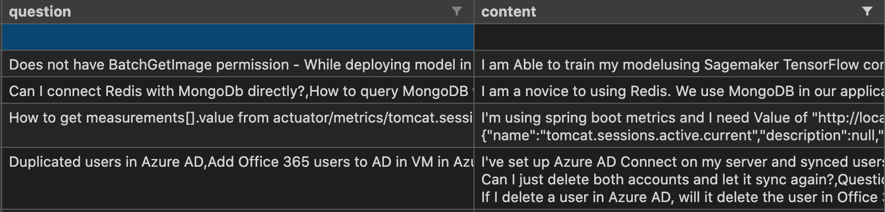

# CZ4045-Natural-Languae-Processing

Python Version - 3.7 is used throughout our project

# Task 3.1 Domain Specific Dataset Analysis

# Web Scraping for Domain 1 Analysis - Scrape StackOverflow Questions
Scrapy is an efficient framework to crawl websites which uses a spider to crawl through websites. 
Firstly, we install scrapy. 
```bash
   $ pip install scrapy
```
We then create a scrapy project directory.
```bash
$ scrapy startproject stack
$ cd stack
```
Then, a scrapy field is created to act as a placeholder for the scraped data. This is done in stack/items.py
```python
# items.py
import scrapy
class StackItem(scrapy.Item):
    # define the fields for your item here like:
    # name = scrapy.Field()
    content = scrapy.Field()
    question = scrapy.Field()
    pass
```
The script Assignment_1_3.1_WebScraping.py is the python script used to scrape from the website. This file is created as stack/spiders/stackoverflow.py
The results are stored in csv file which is done by modifying stack/settings.py
```python
# settings.py
FEED_FORMAT="csv"
FEED_URI="./domain1_dataset.csv"
```
Finally, To scrawl the data, we scrawl 'dataset' as we name out class dataset as seen in Assignment_1_3.1_WebScraping.py
```bash
$ scrapy crawl dataset
```
The results of scraping is shown below - 
